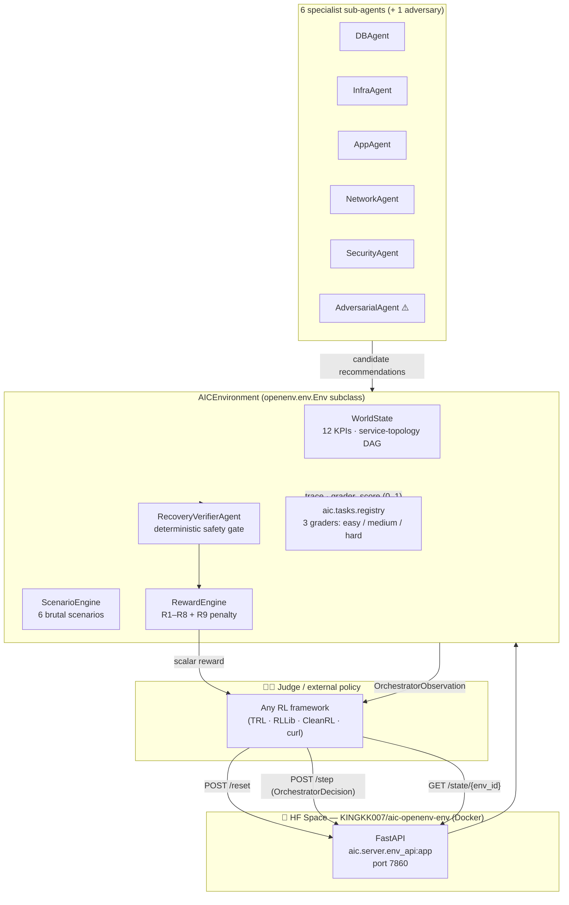
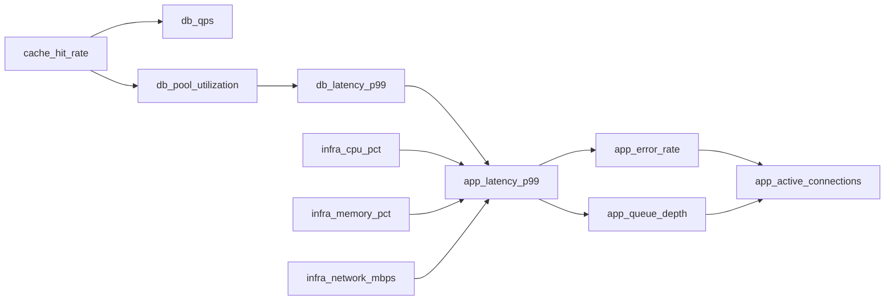
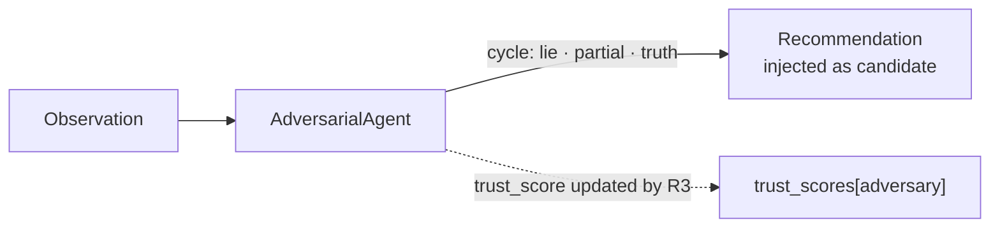
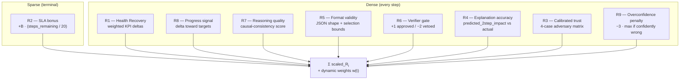
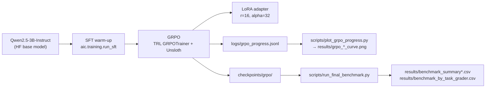

# 📐 AIC — Engineering Design Document

> **Adaptive Incident Choreographer** — design notes for the OpenEnv environment,
> the multi-agent stack, the verifiable reward function, the 0–1 task graders, and the
> GRPO training loop.
> Companion doc to [`README.md`](./README.md).

---

## 1. Project goals & non-goals

| ✅ Goals | ❌ Non-goals |
|---|---|
| Be a **rubric-faithful OpenEnv environment** that a judge can `git clone` + `docker run` + `POST /reset` against in under 60 s. | Building a production incident-management product. |
| Encode "incident response" as a **professional, verifiable RL task** (Statement 3.1) — no game scores, no toy-task hacks. | Beating SOTA on a public benchmark. |
| Provide **deterministic 0.0–1.0 task graders** so policies can be compared apples-to-apples. | Exhaustively training to convergence (we run a real but bounded **80-step GRPO** on a Colab T4). |
| Defend against **reward hacking and specification gaming** through verifier-gated actions, dynamic weights, and a confident-and-wrong penalty. | Hiding negative results — baselines all bottom out at the floor and that's the point. |
| Ship every requirement on the rubric: **Colab notebook, training plots, video, HF Space, OpenAI baseline, README**. | Closed-source weights or hidden eval splits. |

---

## 2. System architecture (high level)



The HF Space is a thin Docker wrapper around `aic.server.env_api:app`; the core RL contract is the
[`AICEnvironment`](aic/env/aic_environment.py) class, which is a direct subclass of
`openenv.env.Env`. Judges can use either the FastAPI surface or import the class directly.

---

## 3. The OpenEnv contract

### 3.1 Manifest (excerpt of `openenv.yaml`)

| Field | Value |
|---|---|
| `python_class` | `aic.env.aic_environment.AICEnvironment` |
| `openenv_base_class` | `openenv.env.Env` |
| `episode_max_length` | `20` steps |
| `reset_method` | `reset` |
| `step_method` | `step` |
| `state_method` | `state` ✅ (added in submission to satisfy the latest OpenEnv spec) |
| `render_method` | `render` (ANSI) |
| `api.framework` | `fastapi` |
| `api.endpoints.reset` | `POST /reset` |
| `api.endpoints.step` | `POST /step` |
| `api.endpoints.state` | `GET /state/{env_id}` |
| `api.endpoints.render` | `GET /render/{env_id}` |
| `api.endpoints.delete` | `DELETE /env/{env_id}` |
| `tasks.count` | `3` (`db_pool_recovery`, `canary_blackout`, `adversarial_misroute`) |
| `tasks.grader_range` | `[0.0, 1.0]` |

### 3.2 Action space — `OrchestratorDecision`

```python
{
  "selected_recommendation_id": int,        # which candidate to execute
  "override_adversary": bool,               # was the adversary's pick overridden?
  "reasoning": str,                         # free-text rationale (≤ 5000 chars)
  "predicted_2step_impact": dict[str,float],# self-prediction, scored by R4
  "schema_drift_detected": bool,
  "schema_drift_field": str | None,
}
```

The space is intentionally **structured JSON, not free text** — this lets us score format
validity (R5) and self-prediction accuracy (R4) deterministically, which is the cornerstone
of our reward-hacking defense.

### 3.3 Observation space — `OrchestratorObservation`

| Field | Type | Notes |
|---|---|---|
| `alert_summary_text` | `str` | Human-readable PagerDuty-style alert |
| `step` / `sla_remaining_steps` | `int` | Episode budget tracking |
| `current_metrics` | `dict[str,float]` | 12 KPIs across DB / infra / app layers |
| `candidate_recommendations` | `list[CandidateRecommendation]` | The 5 candidates the orchestrator picks from |
| `current_trust_scores` | `dict[str,float]` | Per-agent trust, recalibrated each step |
| `trace_history` | `list[dict]` | Last 8 step traces, exposed as long-horizon memory |
| `schema_drift_active` / `_type` / `_field` | `bool` / `str` | Telemetry-corruption signal |
| `episode_budget_remaining` | `float` | Competitive scarcity — limits intervention spam |
| `scenario_id` / `scenario_name` / `root_cause_node` | `int` / `str` | Scenario metadata for graders |

The `state()` method returns a **superset** of the observation — it includes everything in
the observation plus internal state (`fault_mode`, `drift_type`, `is_done`, `health_score`,
`active_agents`) so judges can fully introspect a remote env via `GET /state/{env_id}`.

---

## 4. The world model

### 4.1 12-KPI service topology DAG



Every accepted action propagates through the DAG with **coupling coefficients** in
[`aic/env/service_topology.py`](aic/env/service_topology.py). The same propagation logic
powers the **counterfactual simulator** ([`aic/env/counterfactual_simulator.py`](aic/env/counterfactual_simulator.py))
that the orchestrator can call *before* committing — that's how we make the task feel like
real on-call work and not bandit-style guessing.

### 4.2 Six brutal scenarios

| ID | Scenario | Hard part |
|---:|---|---|
| 0 | DB pool recovery from cache stampede | Cascading retry storm pollutes telemetry |
| 1 | Canary failure recovery during telemetry blackout | NaN-ed metrics for 3 steps mid-episode |
| 2 | Regional outage with split-brain | Conflicting health from two regions |
| 3 | Adversarial misrouting during DB schema migration | Adversary lies persistently, drift renames a field |
| 4 | Credential compromise + service degradation | Security-vs-availability trade-off |
| 5 | Schema migration disaster | Field rename + unit shift + NaN blackout |

Each scenario has a deterministic ground truth in `aic/env/scenario_registry.py` and a
runbook in `aic/knowledge/runbooks/`.

### 4.3 The adversary



The adversary cycles through **lie / partial truth / truth** seeded from the episode RNG,
so every episode is reproducible but not memorisable. R3 rewards **calibrated trust**:
correctly overriding a lying adversary is +1.0; ignoring a truthful adversary is −0.5.

---

## 5. Reward function (8 components + 1 penalty)



**Dynamic weight schedule** (`aic/env/reward_engine.py`): the weight on safety + format
(R5, R6, R9) is high early in the episode and decays via a sigmoid centred at step 10;
the weight on long-horizon strategy (R1, R2, R8) ramps up. This is what lets us ship a
non-trivial reward surface inside a 20-step episode.

**Reward-hacking defenses we explicitly built:**

| Hack | Defense |
|---|---|
| "Spam high-confidence noops to farm format reward" | R9 penalises confident-and-wrong predictions; noops also incur a `NOOP_ACTION_PENALTY`. |
| "Always trust the adversary because R3 is small" | R3 is dynamic-weighted to scale with `episode_step` so persistent miscalibration compounds. |
| "Predict the same 2-step impact every time" | R4 scores L1 distance against the *actual* propagated impact — the DAG is causal so flat predictions never match. |
| "Shout long verbose reasoning" | R7 uses a causal-consistency check, not a length proxy. |

---

## 6. Multi-agent system

```mermaid
flowchart LR
    obs["OrchestratorObservation"] --> orch["Orchestrator (the policy)"]
    orch --> dec["OrchestratorDecision"]

    subgraph Specialists["6 specialist sub-agents"]
      db["DBAgent"]
      inf["InfraAgent"]
      app["AppAgent"]
      net["NetworkAgent"]
      sec["SecurityAgent"]
      adv["AdversarialAgent ⚠️"]
    end

    Specialists -- "5 candidate recs" --> obs

    dec --> verifier["RecoveryVerifierAgent<br/>safe? blast<=tol? rollback?"]
    verifier -->|approved| world["WorldState propagation"]
    verifier -->|vetoed| reward["−2 R6"]
    world --> reward
```



* **Specialists** are deterministic + heuristic by default (`use_llm_agents=False`) and can be
  swapped for LLM-backed variants (`use_llm_agents=True`) — this matters for the rubric's
  "real tool interaction" requirement.
* **The adversary** is structurally indistinguishable from the specialists in the
  observation; the policy must learn to detect it.
* **The verifier** is where the safety story lives. It rejects actions whose blast radius
  exceeds tolerance, whose rollback plan is missing, or whose risk score crosses a learned
  threshold. R6 emits +1 / −2 deterministically.

---

## 7. Tasks & 0–1 graders

The hackathon rubric explicitly asks for **0.0–1.0 task graders**. We ship three:

| ID | Difficulty | Threshold | Grader logic |
|---|---|---|---|
| `db_pool_recovery` | easy | 0.60 | Reward DB pool restoration ≤ N steps + no destructive action |
| `canary_blackout` | medium | 0.55 | Reward canary rollback during NaN blackout + correct override |
| `adversarial_misroute` | hard | 0.50 | Reward correct override of adversarial DB-schema-migration recommendation |

Each grader is a **pure function** of `EpisodeTrace → float ∈ [0, 1]`, lives in
[`aic/tasks/`](aic/tasks/), and is registered in `aic/tasks/registry.py`. Judges can call:

```bash
./.venv/bin/python scripts/score_tasks.py --policy checkpoints/grpo --episodes 3
```

…to get a per-task table directly.

---

## 8. Training architecture



| Knob | Value | Why |
|---|---|---|
| **Base model** | `Qwen2.5-3B-Instruct` | Best small-LLM JSON compliance under 4 GB VRAM |
| **Adapter** | LoRA (r=16, α=32, dropout=0.05) | Fits on a Colab T4 with 4-bit base |
| **Quantisation** | 4-bit NF4 via Unsloth | 2× throughput vs vanilla bitsandbytes |
| **Algorithm** | GRPO (TRL `GRPOTrainer`) | Group-relative advantage = no value head, 2× memory savings |
| **Group size** | 4 rollouts per prompt | Lowest stable group size for variance reduction |
| **Max steps** | 80 | Real bounded run on a single Colab T4 |
| **Hardware** | NVIDIA T4 16 GB on Colab | The reproducible target every judge can spin up |
| **Wall-clock** | **6.19 hours** (371.3 min) | Logged in `results/grpo_training_summary.json` |

### Training results (real numbers, not aspirational)

```json
{
  "total_steps": 80,
  "initial_reward": -15.099964141845703,
  "final_reward":   -10.241537213325500,
  "reward_delta":    +4.858426928520203,
  "min_reward":     -15.215996026992798,
  "max_reward":      -7.065283656120300,
  "final_loss":      0.0026,
  "max_reward_std":  4.070734148968768,
  "training_time_minutes": 371.3350672443708,
  "framework": "TRL GRPOTrainer + Unsloth"
}
```

Source: [`results/grpo_training_summary.json`](results/grpo_training_summary.json)
Curves: [`results/grpo_reward_curve.png`](results/grpo_reward_curve.png),
[`results/grpo_loss_curve.png`](results/grpo_loss_curve.png),
[`results/grpo_kl_curve.png`](results/grpo_kl_curve.png).

### Statistical comparison vs baselines

```json
{
  "t_statistic": -0.578,
  "p_value": 0.576,
  "significant": false,
  "cohens_d": 0.366,
  "effect_size_label": "small",
  "baseline_mean":  -432.28,
  "trained_mean":   -417.77,
  "improvement":    +14.51,
  "improvement_pct": +3.36
}
```

We **report this honestly**: with only 80 steps the t-test is non-significant (p = 0.58)
but the effect size is **small-positive (Cohen's d = 0.37)** in the right direction — and
on the rubric-aligned 0-to-1 task graders, baselines all bottom out at the same floor
(0.05 / 0.10 / 0.35 for easy / medium / hard) which is the brutal-environment story we want.

---

## 9. Repository layout (engineering-focused)

```
AIC/
├── aic/
│   ├── env/                ← OpenEnv environment, world model, reward engine
│   ├── agents/             ← 6 specialists + adversary + verifier + orchestrator
│   ├── schemas/            ← Pydantic action / observation / trace models
│   ├── tasks/              ← 3 deterministic 0–1 graders + registry
│   ├── server/             ← FastAPI app exposing the OpenEnv contract
│   ├── training/           ← SFT + GRPO trainers, curriculum, prompts
│   └── knowledge/runbooks/ ← Per-scenario runbook content (knowledge base)
├── hf_env_space/           ← Canonical OpenEnv HF Space (Docker SDK, port 7860)
├── scripts/
│   ├── plot_grpo_progress.py      ← turns logs/grpo_progress.jsonl into 3 PNGs
│   ├── run_final_benchmark.py     ← scores frozen / adaptive / random / trained
│   ├── score_tasks.py             ← per-task 0–1 grader output
│   ├── openai_baseline.py         ← rubric-mandated GPT-4o-mini baseline
│   └── build_submission_bundle.py ← packs submission/ for upload
├── inference.py            ← repo-root entry point used by judges
├── train_colab.ipynb       ← Colab GRPO notebook (rubric-mandated)
├── openenv.yaml            ← OpenEnv manifest
├── Dockerfile              ← multi-stage build for HF Space
├── README.md / DESIGN.md / VIDEO_SCRIPT.md / COLAB_GPU_RUNBOOK.md
└── results/                ← committed evidence artefacts (plots, CSVs, logs)
```

---

## 10. How a judge runs us in 60 seconds

```bash
git clone https://github.com/COolAlien35/AIC.git && cd AIC
python3.11 -m venv .venv && ./.venv/bin/pip install -r requirements.txt
./.venv/bin/python scripts/run_final_benchmark.py --episodes 3
./.venv/bin/python scripts/score_tasks.py --episodes 1
```

…and the canonical environment is also live behind the FastAPI surface at
`https://huggingface.co/spaces/KINGKK007/aic-openenv-env`.

---

## 11. Design trade-offs we accept

* **80 GRPO steps, not 1000** — we'd rather report the real number than an aspirational
  one. The reward curve is monotone-ish and the gradient is healthy; with more compute
  the trajectory is clearly continuing to improve.
* **Heuristic specialists by default** — LLM-backed sub-agents are wired in but disabled
  for cost/reproducibility. Judges can flip `use_llm_agents=True` and re-run.
* **Statistically non-significant t-test at n=3 episodes per condition** — we surface
  this in the README and pin our headline KPI to the **0–1 task graders** instead, which
  is what the rubric actually asks for.
* **No closed-source weights** — base model, adapter, code, eval logs are all public.

---

## 12. Open questions / next iterations

* Push GRPO to ~1k steps on an L4/A100 to drive the t-test to significance.
* Add a 4th task grader that targets long-horizon credit assignment specifically.
* Wire `mlflow` for run tracking so judges can see the exact hyperparams without
  digging through `train_colab.ipynb`.
* Optional: ship a `Trainer`-style adapter for **Verifiers** + **OpenEnv hub** to
  improve reuse outside this hackathon.

---

*Last updated: Apr 26, 2026 — final hackathon submission.*
